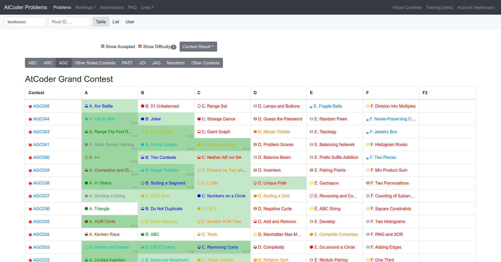

# AtCoder Problems

[AtCoder Problems](https://kenkoooo.com/atcoder/) is a web application to help AtCoder users to solve problems and manage progress more efficiently.

# Documents
- [Front-end web application](./atcoder-problems-frontend/README.md)
- [Back-end server application](./atcoder-problems-backend/README.md)
- [API / Datasets](./doc/api.md)
- [FAQ (en)](./doc/faq_en.md) / [FAQ (ja)](./doc/faq_ja.md)
